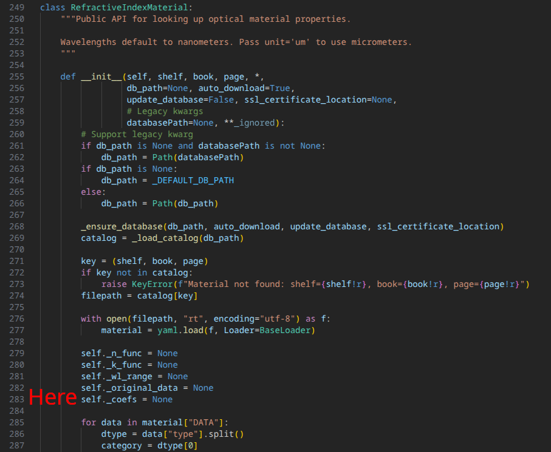
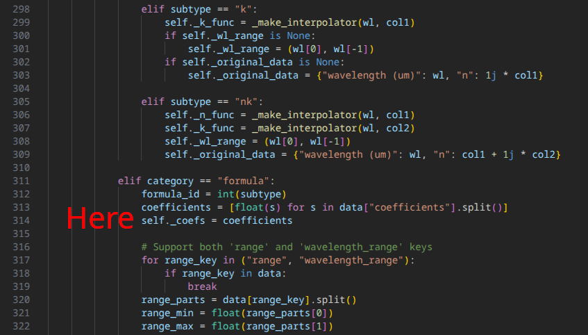
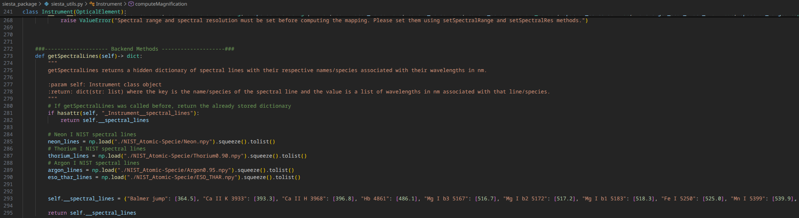

# SIESTA App: Simulating Interactive Echelle Spectroscopy for Targeted Applications

# Installation
```
git clone https://github.com/DorianArm/SIESTA.git
cd SIESTA/
pip install .
```
Once the required packages installed, make sure to modify the refractiveindex.py file from its package. 2 lines have to be added to be able to use prisms with SIESTA:

```
self._coefs = None # in __init__ method of RefractiveIndexMaterial class, line 283
self._coefs = coefficients just after coefficients variable declaration, line 314
```




# Examples
The jupyter notebook siesta_example.ipynb (need jupyter dependencies) shows 2 example usecases of SIESTA, with all the useful main functions.

# Modifying the list of spectral lines
To modify the list of displayable spectral lines, the siesta_utils.py file has to be changed.
In the getSpectralLines method (starting line 273), the __spectral_lines dictionary is holding the wavelengths of specific spectral lines (in nm) and .npy files of group of spectral lines (e.g. visible transition of Neon I). This creates the drop-down list of spectral lines to show in the SIESTA web browser interface.
To add a specific spectral lines, just add a new element to the dictionary with its name and its value in nanometers. To add a group of spectral lines, add the .npy file to the dictionary as a value, with a convenient name as a dictionary key. To create these .npy files (1-D array of wavelength values in nm), I also share my parser that I used for the NIST database where I could also filter the most intense spectral lines (according to the database).


